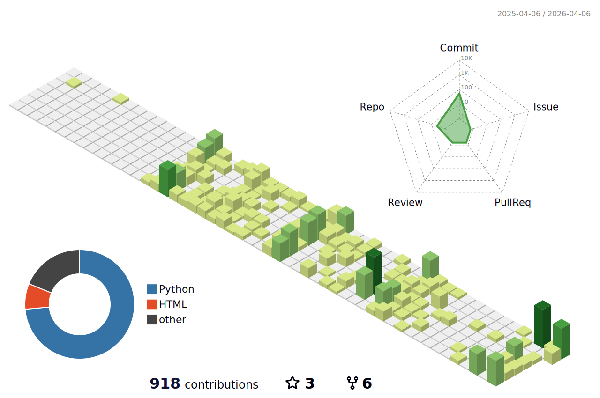

<!-- 🔥 Killer GitHub Profile README for praveenbhardwaj -->

# 👋 Hi, I'm <strong>Praveen Kumar Bhardwaj</strong>  

 
🌱 Passionate Developer • 🚀 Open Source Contributor • 🤖 Machine Learning Enthusiast  

  

## 🚀 What I'm Up To

- 🔬 **ML Models for Polymer Prediction** (Sustainable AI 🌱)  
- 🧑‍💻 Exploring **React, Next.js, Flutter, Firebase**  
- 🌟 Contributing to **GSsoc / SSOC** Projects  
- 🎯 2025 Goal → Build impactful AI projects & ship dev tools  

  

 

## 🏆 Achievements & Stats  

  

  
  

  

  

  

## 🧊 3D Contribution Graph  

  

  

## 🐍 Contribution Snake  

  

  

  <picture>
    <source media="(prefers-color-scheme: dark)" srcset="./dist/github-snake-dark.svg" />
    <source media="(prefers-color-scheme: light)" srcset="./dist/github-snake.svg" />
    
  </picture>

## ⚡ Tech Arsenal  

  

   
   
   
  

## ✨ Highlighted Projects  

  

- 🔬 **Polymer Property Prediction AI** → Sustainable Materials Screening  
- 📊 **Dev Widget (Flutter)** → LeetCode, GFG, GitHub Stats with Weekly Graph  
- 🤝 **GSsoc/SSOC Contributions** → Open Source Growth  

## 🔗 Connect with Me  

  
  
  
  

✨ 3D graph: [github-profile-3d-contrib](https://github.com/yoshi389111/github-profile-3d-contrib) • Snake: [Platane/snk](https://github.com/Platane/snk) • GIFs/Badges: [Cool-GIFs-For-GitHub](https://github.com/Anmol-Baranwal/Cool-GIFs-For-GitHub)

